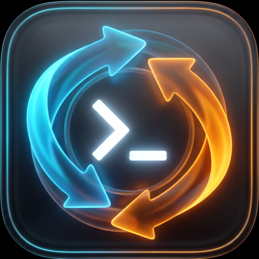
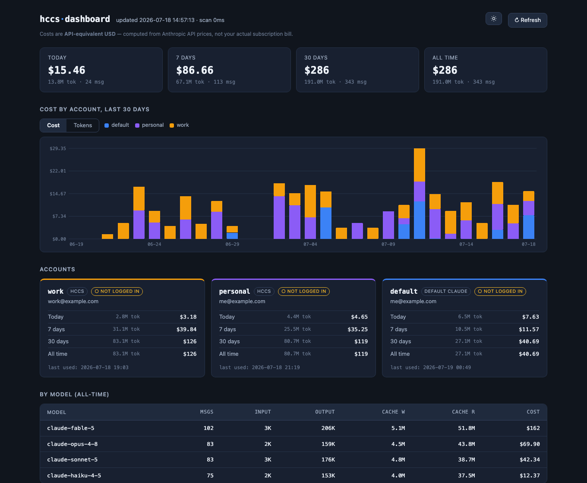

<div align="center">
  

# hccs

**Switch account Claude Code tức thì. Biết chính xác mỗi account tốn bao nhiêu.**

CLI mỏng bọc quanh [`claude`](https://claude.com/claude-code) — dùng chung một `~/.claude` (history, agents, skills, hooks), login tách riêng, kèm **dashboard usage & cost** per-account chạy local.

[](LICENSE)


[English](README.md) | **Tiếng Việt**

</div>

```sh
hccs work --resume        # chạy claude dưới account "work", passthrough mọi flag
hccs personal -p "hi"     # account "personal" — không cần login lại
hccs dashboard            # usage & chi phí per-account, mở trong browser
```

- 🔁 **Switch tức thì** — mỗi account login một lần, sau đó `hccs <account>` là chạy
- 🧰 **Passthrough đầy đủ** — `hccs <account> [args...]` ≡ `claude [args...]` (`--resume`, `-c`, `-p`, ...)
- 🤝 **Share mọi thứ trừ auth** — agents, skills, hooks, settings, lịch sử session
- 📊 **Trace chi phí chuẩn** — attribution per-account, đúng cả khi `--resume` chéo account
- 🧹 **Gỡ sạch** — setup Claude mặc định không bao giờ bị đụng



## Cơ chế

Claude Code hỗ trợ biến môi trường `CLAUDE_CONFIG_DIR`. Khi set, Claude tách **file `.claude.json`** (danh tính account) **và credential** riêng theo config dir.

`hccs` tận dụng đúng cơ chế built-in này: mỗi account là một config dir riêng dưới `~/.hccs/accounts/<name>`, và **symlink toàn bộ `~/.claude`** (agents, skills, hooks, commands, settings, projects, history) vào đó. Kết quả: **chỉ authen là tách riêng** — còn lại dùng chung, kể cả lịch sử session (`--resume` thấy được session của account khác).

```
~/.hccs/accounts/<account>/       # = CLAUDE_CONFIG_DIR
├── .claude.json                 # RIÊNG: danh tính (seed từ ~/.claude.json, bỏ oauthAccount)
├── .credentials.json            # RIÊNG: token (chỉ Linux — macOS dùng Keychain)
└── <mọi entry của ~/.claude>    # symlink → dùng chung
```

### Credential lưu ở đâu (theo OS)

| OS | Nơi lưu token | Hệ quả |
|----|---------------|--------|
| **macOS** | Keychain, slot `Claude Code-credentials-<sha256(configDir)[:8]>` | Nằm ngoài config dir → `remove`/`uninstall` phải xoá slot riêng (hccs tự làm) |
| **Linux** | File `<configDir>/.credentials.json` | Nằm trong config dir → tự cô lập, mất theo dir |

`hccs` không bao giờ tự đọc/ghi token — Claude tự quản theo `CLAUDE_CONFIG_DIR`.

## Cài đặt

**Qua npm:**

```sh
npm install -g hccs
hccs setup-hook      # đăng ký hook attribution cho dashboard (một lần)
```

**Từ source:**

```sh
git clone <repo-này> && cd <thư-mục-repo>
./install.sh         # cài vào ~/.local/bin + tự đăng ký hook
```

**Yêu cầu:** macOS hoặc Linux, `claude` trong PATH, `python3`.
Ubuntu/Debian nếu thiếu: `sudo apt install python3`.

## Lệnh

| Lệnh | Mô tả |
|------|-------|
| `hccs <account> [claude args...]` | Chạy claude dưới account, passthrough mọi flag |
| `hccs add <account> [claude args]` | Tạo account mới rồi login một lần |
| `hccs list` | Liệt kê account + email |
| `hccs which` | Account dùng gần nhất |
| `hccs remove <account>` | Xoá account (config dir + credential) |
| `hccs dashboard [--port N]` | Mở dashboard usage/cost (localhost) |
| `hccs setup-hook` | Đăng ký (lại) SessionStart hook attribution |
| `hccs uninstall` | Gỡ sạch hccs, **không đụng** Claude mặc định |
| `hccs -h` \| `--help` | Trợ giúp |

## Bắt đầu nhanh

```sh
hccs add work        # tạo + login account "work"
hccs add personal    # tạo + login account "personal"

hccs work            # dùng account work
hccs personal        # đổi sang personal — KHÔNG cần login lại
hccs list            # xem account + email
```

Mỗi account login một lần duy nhất. Sau đó switch tức thì.

## Dashboard usage & chi phí

```sh
hccs dashboard       # mở http://127.0.0.1:4780 (headless thì in URL)
```

Trang localhost (chỉ bind `127.0.0.1`) hiển thị **chi phí + token per-account** (hôm nay / 7 ngày / 30 ngày / tất cả), đồ thị stacked 30 ngày (toggle cost ↔ tokens), bảng theo model, panel auth read-only. Có theme sáng/tối. Chi phí là **API-equivalent USD** (quy theo giá API Anthropic — không phải bill subscription).

**Attribution hoạt động thế nào:** transcript trong `~/.claude/projects` không chứa danh tính account, nên `install.sh` đăng ký một **SessionStart hook** (`hccs-attribution-hook`) vào `~/.claude/settings.json` (backup trước lần sửa đầu, gỡ sạch khi uninstall). Mỗi lần mở session, hook ghi `(thời điểm, session_id, account)` vào `~/.hccs/usage/attribution.jsonl`; dashboard attribute từng message theo mốc thời gian — đúng cả khi account khác `--resume` session cũ. Session không rõ nguồn hiển thị là *unattributed*.

- Máy đã cài hccs từ trước khi có dashboard? Chạy lại `./install.sh` (hoặc `hccs setup-hook`).
- Giá model override qua `~/.hccs/pricing.json`: `{"claude-x": [in, out, w5m, w1h, read]}` (USD/1M token).
- Kết quả scan cache ở `~/.hccs/usage/cache.json` — mở lần sau gần như tức thì; `hccs-dashboard.py --rebuild` để scan lại từ đầu.
- Hook được bọc để **không bao giờ** làm hỏng/chậm claude startup (exit 0 vô điều kiện, không network).

## Gỡ cài đặt

```sh
hccs uninstall
```

Xoá `~/.hccs`, mọi Keychain token của account hccs, binary, dashboard (`~/.local/share/hccs`), dòng PATH, và gỡ SessionStart hook khỏi `settings.json` (chỉ đúng entry của hccs). **Không** chạm tới phần còn lại của `~/.claude`, `~/.claude.json`, hay account Claude mặc định.

## Giới hạn

- **macOS + Linux.** Chưa hỗ trợ Windows.
- `.claude.json` tách riêng mỗi account: seed từ account mặc định (giữ trust-dialog/MCP), nhưng thay đổi trust/MCP-per-project về sau không tự đồng bộ giữa các account.

## An toàn

- `hccs` chỉ **symlink** từ `~/.claude` (không ghi vào đó, trừ entry hook settings.json bạn đã đồng ý) và lưu dữ liệu trong `~/.hccs`.
- `uninstall`/`remove` chỉ đụng credential của account hccs: trên macOS chỉ xoá Keychain slot **có hash** (slot mặc định `Claude Code-credentials` không bao giờ bị đụng); trên Linux credential nằm trong config dir nên mất theo đúng account đó.
- `rm -rf ~/.hccs` chỉ xoá symlink, không follow vào `~/.claude`.
- Dashboard chỉ bind `127.0.0.1` và validate `Host` header (chống DNS-rebinding). API chỉ lộ email + số liệu usage, không bao giờ lộ token.

## License

[MIT](LICENSE)
